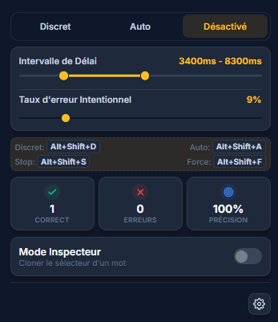
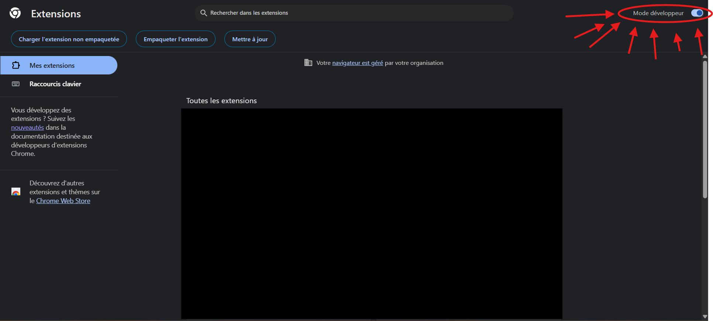
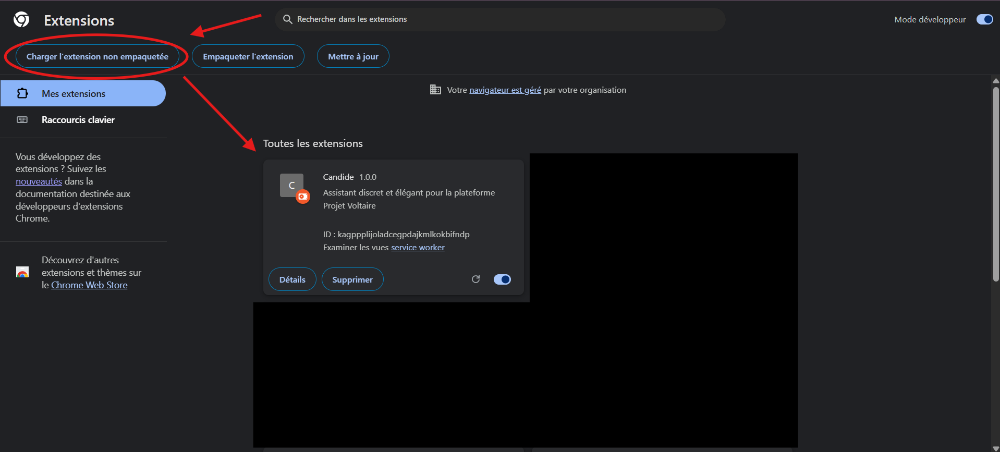

# 🍃 Candide (ex-Voltaire Solver)

> **"Il faut cultiver notre jardin."** — Voltaire, *Candide*

**Candide** est un assistant intelligent, élégant et ultra-discret pour la plateforme **Projet Voltaire**. 

Ce projet est une version personnalisée et optimisée "à ma sauce" à partir d'un outil existant. Le design a été entièrement refondu pour être moderne, épuré, et surtout d'une discrétion absolue pour un usage fluide et invisible.

---

## ✨ Fonctionnalités clés

- 🤫 **Mode Discret (Manuel)** : Soulignement en pointillés ultra-fins (`rgba(128, 128, 128, 0.45)`) de la bonne réponse. Visuellement indétectable pour un œil non averti, mais parfait pour vous guider.
- ⚡ **Mode Automatique** : Résolution automatique intelligente avec gestion du taux d'erreur et des délais configurables pour simuler un comportement humain.
- 🎛️ **Interface Premium** : Design minimaliste basé sur la police *Inter*, palette Slate/Amber élégante et support complet du mode sombre.
- ⌨️ **Raccourcis Clavier Globaux** :
  - `Alt + Shift + D` : Activer instantanément le **Mode Discret** (avec réévaluation immédiate de la phrase en cours)
  - `Alt + Shift + A` : Activer le **Mode Automatique**
  - `Alt + Shift + S` : Désactiver l'assistant (Mode Inactif)
  - `Alt + Shift + F` : Forcer la résolution de la phrase actuelle uniquement

---

## 📸 Aperçu

| Mode Sombre minimaliste | Réglages avancés |
|---|---|
|  |  |

*(Ajoutez vos captures d'écran dans le dossier `screenshots/` pour les afficher ici)*

---

## 🛠️ Installation

L'extension s'installe manuellement en quelques clics via le mode développeur de votre navigateur (Chrome, Brave, Edge, Opera...).

### Étape 1 : Télécharger ou cloner le projet
Clonez ce dépôt ou téléchargez-le sous forme d'archive ZIP et extrayez-le sur votre ordinateur.

### Étape 2 : Ouvrir la page des extensions
Dans votre navigateur basé sur Chromium (Chrome par exemple) :
1. Ouvrez un nouvel onglet et accédez à : `chrome://extensions/`
2. Ou via le menu : **Options (trois points)** > **Extensions** > **Gérer les extensions**.

### Étape 3 : Activer le Mode Développeur
En haut à droite de la page des extensions, activez l'interrupteur **Mode développeur**.

### Étape 4 : Charger l'extension
1. Cliquez sur le bouton **Charger l'extension non empaquetée** (en haut à gauche).
2. Sélectionnez le dossier contenant les fichiers du projet (le dossier qui contient le fichier `manifest.json`).

🚀 **C'est tout !** L'extension est installée et prête à l'emploi sur Projet Voltaire.

---

## ⚙️ Configuration recommandées
Pour une discrétion maximale en mode automatique :
- **Délais** : Utilisez un intervalle de `2000ms - 4000ms` pour simuler une vitesse de lecture humaine.
- **Taux d'erreur** : Configurez-le entre `5%` et `15%` pour ne pas éveiller de soupçons avec un score parfait de 100% trop rapide.

---

## 📝 Mentions Légales & Origine
*Ce projet est une version modifiée et personnalisée pour un usage strictement privé et éducatif. Il s'appuie sur une base de code existante d'un autre développeur, réécrite et adaptée pour améliorer l'expérience utilisateur, l'esthétique générale, la réactivité des raccourcis et la discrétion visuelle.*
